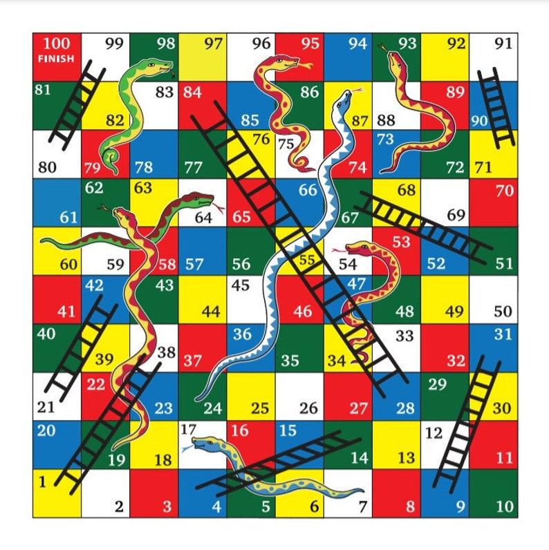

# snakes-and-ladders-js

## Challenge

Using JS write code that mimics the classic game of snakes and ladders.

## Acceptance Criteria

- Should log the progress of each player for every turn
  - `Turn 1: Bob rolls 4 and moves to 10 | Alice rolls 2 and moves to 8`
  - `Turn 7: Bob rolls 4 and moves up to 60 (LADDER) | Alice rolls 2 and moves down to 28 (SNAKE)`
- Should log the final result
  - `Alice is the winner!!`

## Snakes and Ladder Board

